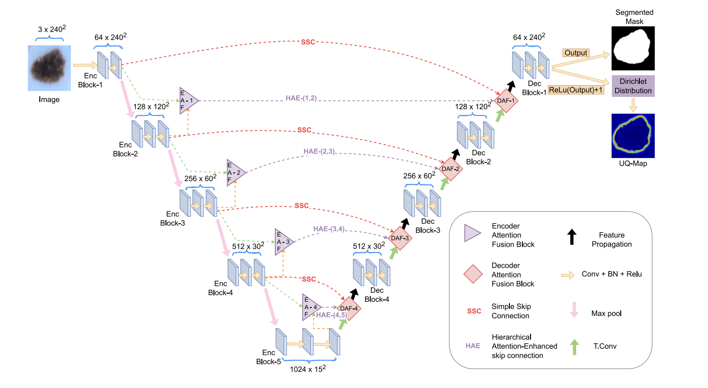

# Attention-Guided Hierarchical Fusion U-Net for Brain Tumor Segmentation

This repository contains the PyTorch (self)implementation of the **Attention-guided Hierarchical Fusion U-Net (AHF-U-Net)**, a novel U-Net variant for medical image segmentation. The model is evaluated on the **Brain Tumor Segmentation (BraTS)** dataset and achieves a Dice Loss of **0.8012** (could be improve with hyperparameter tuning) using limited computational resources. 

---

## Overview

The AHF-U-Net extends the traditional U-Net by introducing:
- **Encoder Attention Fusion (EAF) module** and **Decoder Attention Fusion (DAF) module**: Incorporating spatial and channel attention mechanisms to refine spatial information and channel selection during encoding and decoding.
- **Hierarchical Attention-Enhanced (HAE) skip connections**: Enhancing feature reuse and improving boundary refinement.

---

## Dataset Description

This implementation utilizes the **BraTS multimodal brain tumor segmentation dataset**, which consists of pre-processed 3D MRI scans provided as **NIfTI files** (`.nii.gz`). The dataset includes four modalities for each patient:
1. **T1-weighted (T1)**: Native contrast images.
2. **Post-contrast T1-weighted (T1Gd)**: Enhanced contrast images.
3. **T2-weighted (T2)**: Images capturing tissue water content.
4. **T2-FLAIR**: Fluid-attenuated inversion recovery scans.

### Segmentation Labels
The dataset provides manually annotated labels approved by expert neuro-radiologists. The labels include:
- Necrotic and non-enhancing tumor core (NCR/NET).
- Peritumoral edema (ED).
- GD-enhancing tumor (ET).

---

## Algorithm Highlights

**U-shaped architectures** like U-Net are widely used for medical image segmentation, providing accurate diagnostic predictions. However, many such methods do not quantify uncertainty in their predictions. To address this gap:
- **AHF-U-Net** is proposed to combine channel and spatial attention mechanisms, capturing both local and global contextual information.
- **UA-AHF-U-Net** extends this with uncertainty maps, highlighting areas of low confidence to assist radiologists in focusing on critical regions.

Key innovations in AHF-U-Net include:
1. **Encoder Attention Fusion (EAF)** and **Decoder Attention Fusion (DAF)** modules to selectively emphasize relevant spatial regions and feature channels.
2. **Hierarchical Attention-Enhanced (HAE) skip connections** for better feature integration across scales.

---

## Results

- **Dice Loss**: 0.8012
- The result could be improve by performing hyperparameter tuning on desired resources.
- Environment: Trained on Kaggle with limited computational resources, limiting hyperparameter tuning potential.

## Weights

The best model weights is provided in this repository as **best_model.pth**.

## Citation

The paper corresponding for the algorithms and dataset are as below :

### Algorithm
Munia, A. A., Abdar, M., Hasan, M., Jalali, M. S., Banerjee, B., Khosravi, A., ... & Frangi, A. F. (2025). Attention-guided hierarchical fusion U-Net for uncertainty-driven medical image segmentation. Information Fusion, 115, 102719.

### Dataset
B. H. Menze, A. Jakab, S. Bauer, J. Kalpathy-Cramer, K. Farahani, J. Kirby, et al. "The Multimodal Brain Tumor Image Segmentation Benchmark (BRATS)", IEEE Transactions on Medical Imaging 34(10), 1993-2024 (2015) DOI: 10.1109/TMI.2014.2377694

